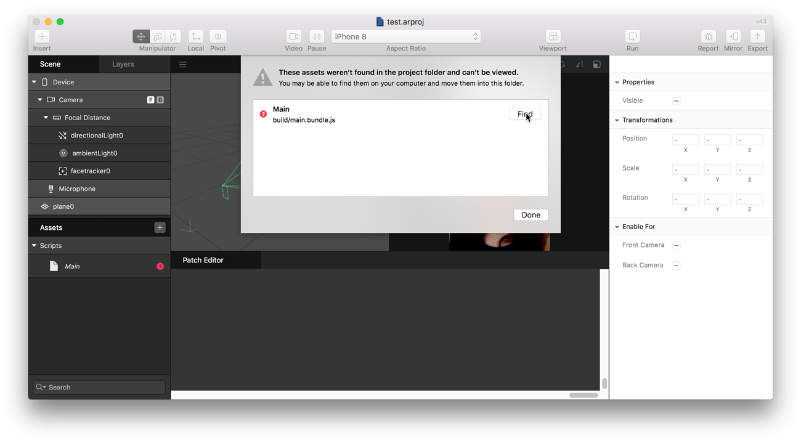

# Locate the build script

When you run an AR Studio project for the first time, you might come across this dialog:

In this case, you have to locate the build script, that webpack generates. This guide will explain to you how to do this.

## Step 1

- Click find in the dialogue
- Navigate to the folder of the project.

## Step 2

- Navigate to the "build" folder in the project.
- Select the "main.bundle.js" file
- Click "open"

## Step 3

- There should now be a green checkmark next to the file (see picture).
- Click on "Done".

## Step 4

- Click on "Run" in AR Studio
- There should now be an error in the console output. This error is intentionally added to the script.js source file (line 13) to test the error logging in Tawang.

## Further reading

Read the [Getting started](#) guide to learn how to use Tawang in AR Studio.
