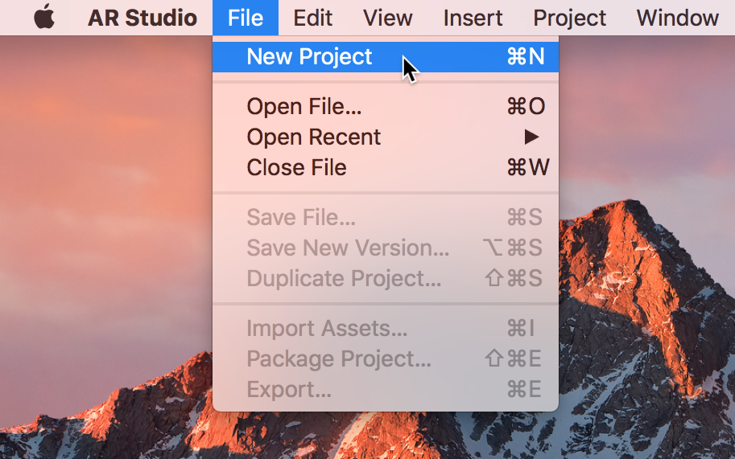
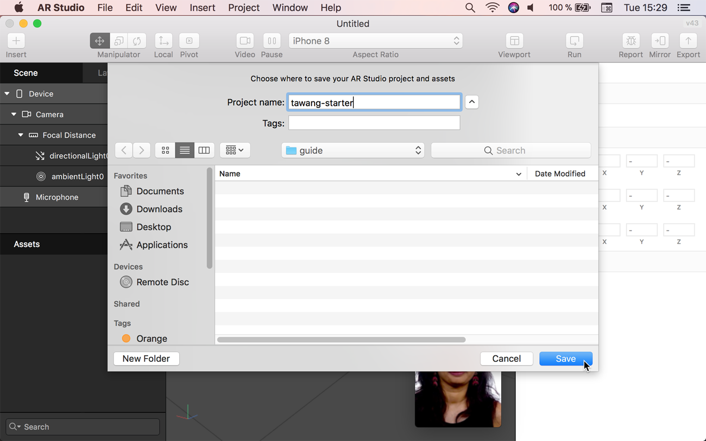
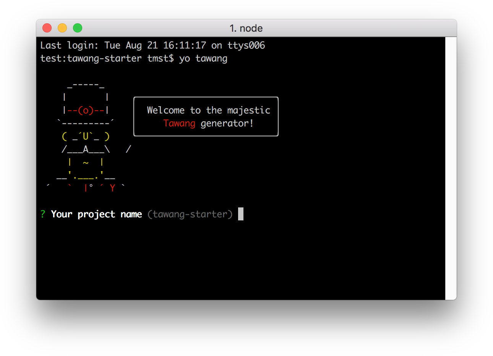
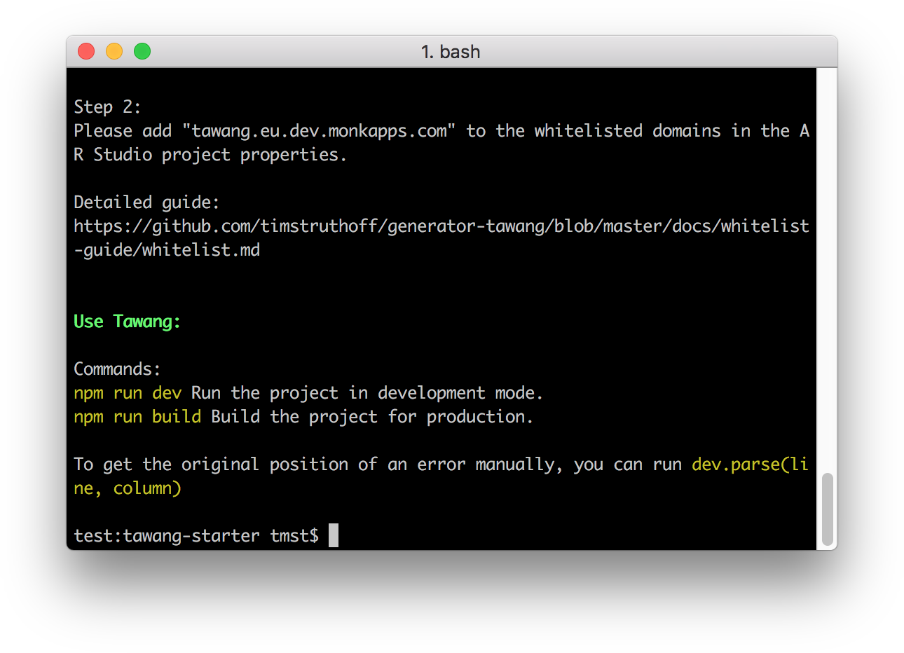
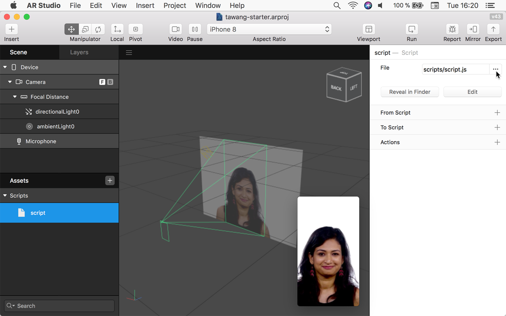
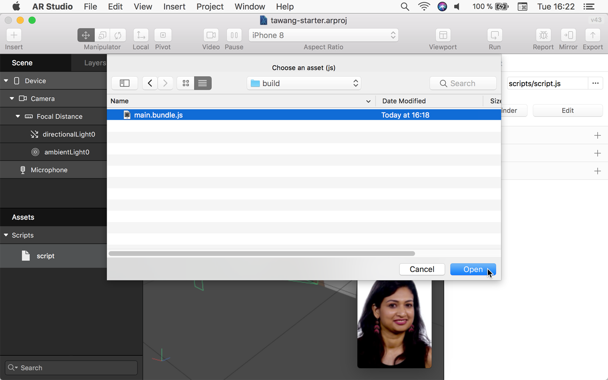
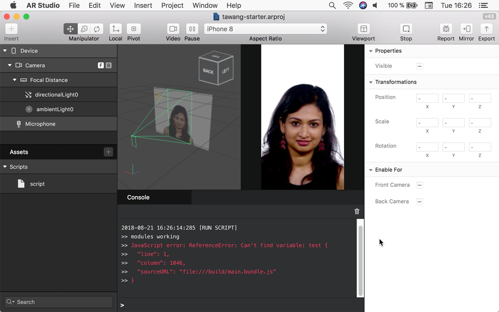
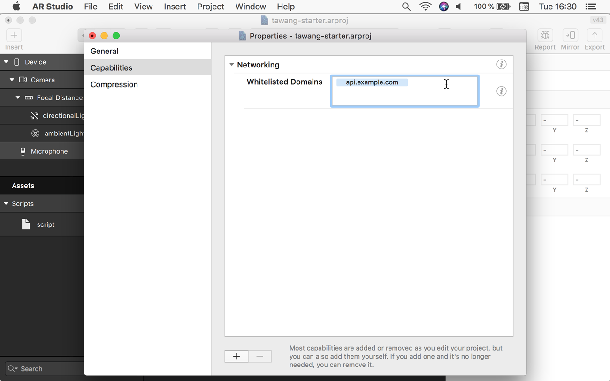
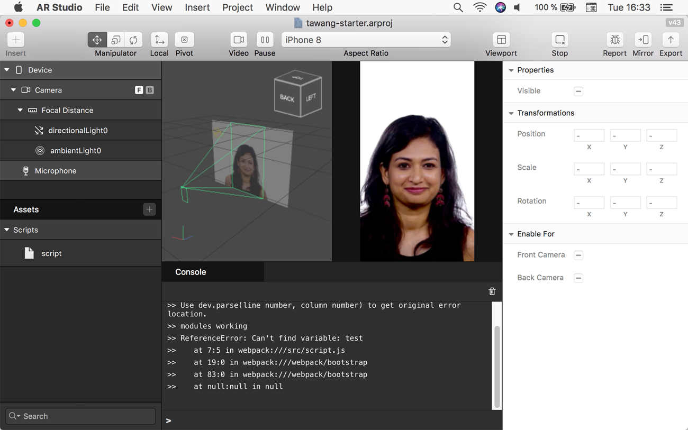

# Getting started

As Tawang is a plugin for working with AR Studio, there are some manual steps required when setting up a project.

## Step 1 Create Project

- Create a new project in AR Studio.

- Save the project somewhere and remember the location.

## Step 2 Run the generator

- Open a terminal window at the location of the project directory, so that the current directory is *inside* the project directory.
- Run `yo tawang`

## Step 3 Include output in AR Studio

- Open the project in AR Studio if it isn't already open.
- Click on the plus symbol next to assets.
- Click on "Create New Script".

- Click on the three dots next to the file path and select replace. 

- Navigate to the project's directory. 
- Navigate inside the build directory.
- Select the webpack output file (e.g. "main.bundle.js").

## Step 4 Verify

- There should now be an error in the console. This is intentional.
- Because Tawang only built a production version of the project, this error is not parsed yet. To enable error parsing, some additional steps are required, as explained in the following.

## Step 5 Whitelist the API server

To parse errors, Tawang needs an external API Server. The plugin accesses this server using the [Networking](https://developers.facebook.com/docs/ar-studio/reference/networking_module) module in AR Studio. Before you can connect to an external server in AR Studio, you have to add it's domain to a whitelist. This guide will explain to you how to do this.

### Step 5.1: Open properties

- Open the project in AR Studio.
- Click on "Project" in the menu bar.
- Click on "Edit Properties...".

### Step 5.2: Locate the whitelist

- Select the "Capabilities" tab on the left.
- Expand the "Networking" accordion section.
- Place your cursor in the "Whitelisted Domains" text field.

### Step 5.3: Add the domain

- Write or paste the domain into the text field.
- *Important: Press the Enter Key on your keyboard*.

### Step 5.4: Save

- Close the properties window.
- Save the project.
- Run your code.

## Step 6 Final verify

- There should now be an error in the console. This error should have a stack trace with the locations in the original sources.
