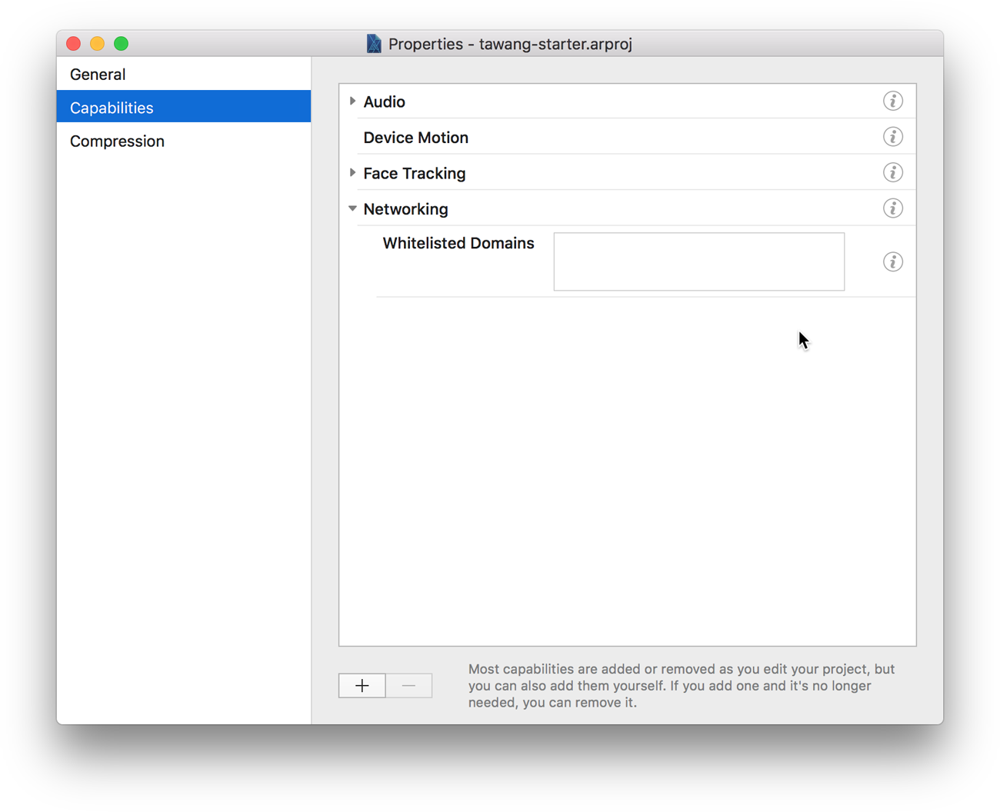
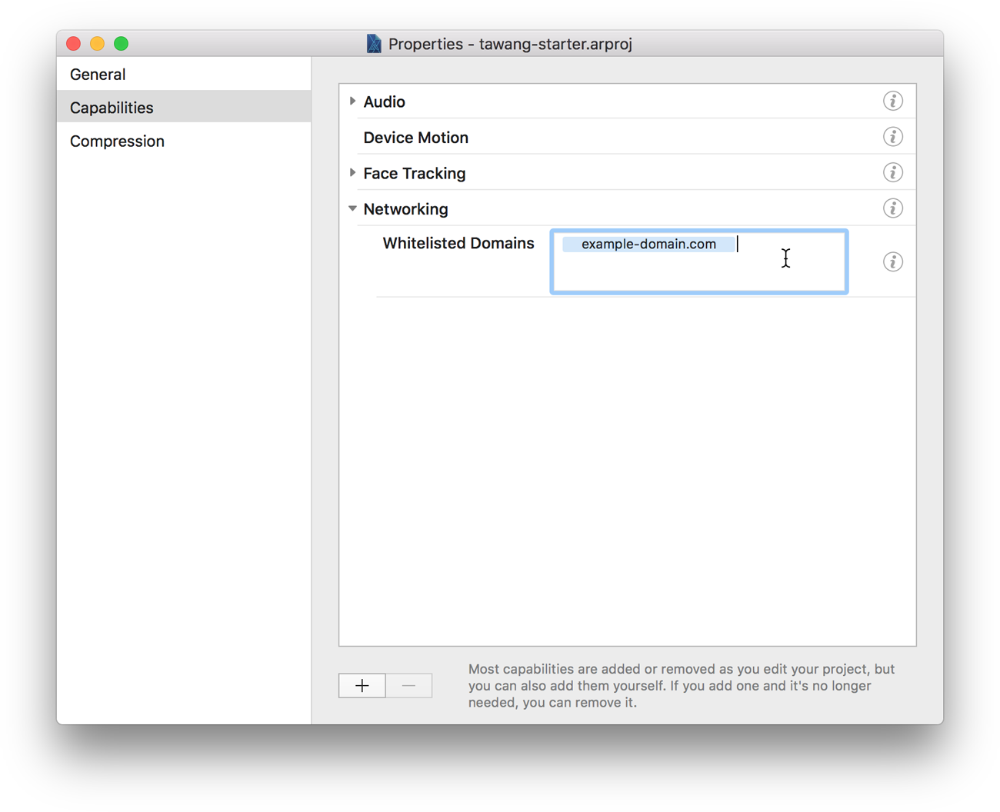

# Add a domain to the whitelisted domains in AR Studio

In order to parse errors, Tawang needs an external API Server. The plugin acceses this server using the [Networking](https://developers.facebook.com/docs/ar-studio/reference/networking_module) module in AR Studio. Before you can connect to an external server in AR Studio, you have to add it's domain to a whitelist. This guide will explain to you how to do this.

## Step 1: Open properties

- Open the project in AR Studio.
- Click on "Project" in the menu bar.
- Click on "Edit Properties...".

## Step 2: Locate the whitelist

- Select the "Capabilities" tab on the left.
- Expand the "Networking" accordion section.
- Place your cursor in the "Whitelisted Domains" textfield.

## Step 3: Add the domain

- Write or paste the domain into the textfield.
- *Important: Press the Enter Key on your keyboard*.

## Step 4: Save

- Close the properties window.
- Save the project.
- Run your code.